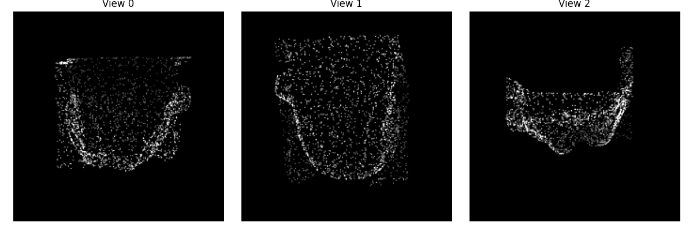

# Bridging 2D and 3D — Adapting 2D ViTs for 3D Point Cloud Understanding

> Bastian Berle - Christian Traxler
 
## Instructions

First, install all requirements:

```
pip3 install -r requirements.txt
```

*Note:* Depending on your specific hardware, you might need to install a compatible version of Torch with the corresponding CUDA support.

Then, install the package locally in editable mode:

```
pip3 install -e .
```

## Experiment

The results of the experiments under `results/`.


Example GIF showing the learned viewing angles across epochs:

